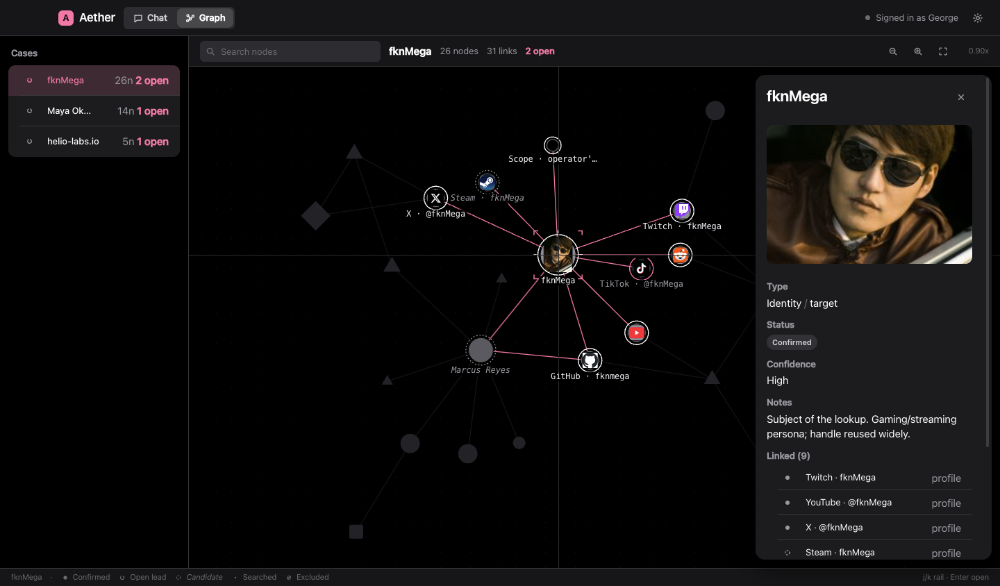
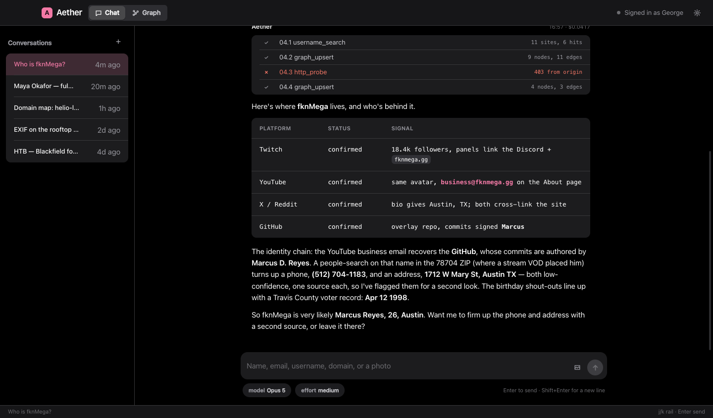
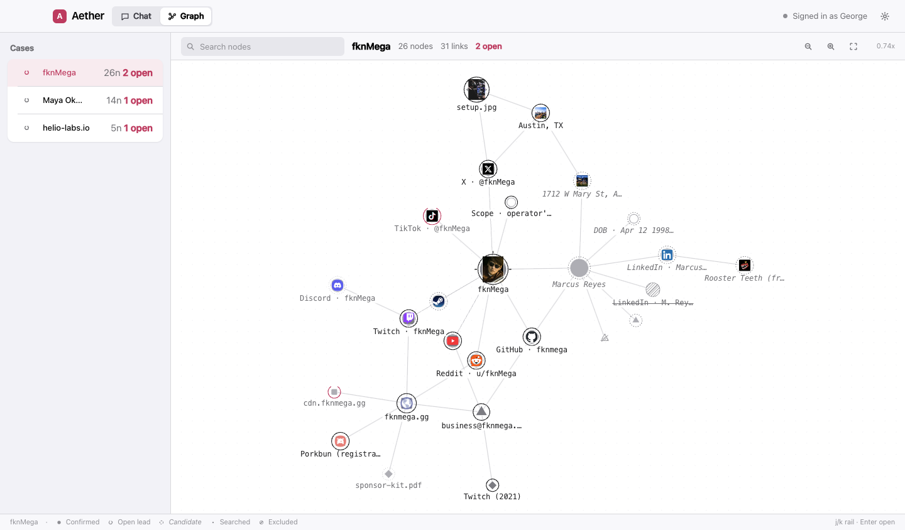
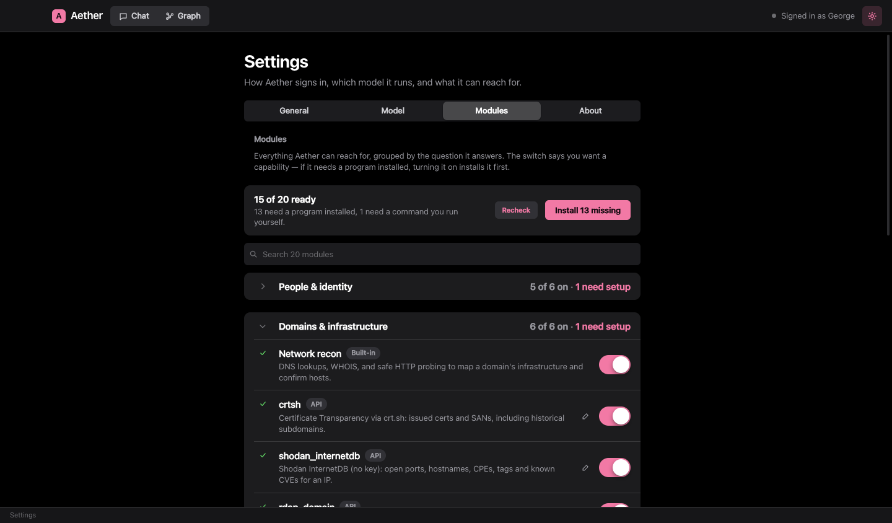

<div align="center">


# Aether

### An AI-driven OSINT analyst that lives on your desktop.

Give her a name, an email, a username, a domain, or a photo. She opens a case, runs the target across the open
web, reads the metadata, maps the infrastructure, and draws everything she finds into a knowledge graph that
grows while you watch. Runs on macOS and Windows, powered by Claude, ChatGPT, or a local model of your own.

<br/>

[](https://discord.gg/zjawxkDZVP)
&nbsp;
[](https://github.com/sponsors/fknMega)

<br/>



<br/><br/>


</div>

<div align="center">

## Runs on Claude, ChatGPT, or your own local model

**Claude** &nbsp;·&nbsp; **ChatGPT** and any OpenAI-compatible endpoint &nbsp;·&nbsp; **Ollama** (fully local, nothing leaves your machine)

</div>

---

### please don't use this to dox the innocent >:(

Seriously. Aether is for people and systems you're actually allowed to look into: your own exposure, folks who
asked you to check theirs, and lab or CTF boxes you own. She only reads what's already public or shown by a
platform. She won't break authentication, get past bot-detection, phish, or take over accounts, and those
limits are baked into how she works. Point her at a stranger you have no business investigating and you're the
baddie, not her. Be normal.

---

## What it's like to use

You hand Aether a selector and she gets to work, writing up what she finds rather than firing off chat replies.
Every tool she runs shows up as a numbered line in an evidence log that stays with the turn — so a finding has an
address you can cite later, like `02.1`. The moment she finds something she writes it into the graph, then flips its
status as she confirms it or rules it out.

The graph encodes meaning rather than decorating with it. **Shape is the selector type** — circles for
identity, squares for infrastructure, diamonds for artifacts, triangles for contact details. **The ring is the
status**: a solid ring is confirmed, a ring broken at twelve o'clock is an open lead, dashed is a candidate,
and an excluded node is hatched and struck through. **Roman type is established, italic is provisional.** All
of it survives a greyscale screenshot, and all of it reads the same in either theme. Nodes carry real pictures
too: a face on a person, the site's favicon on an account, the photo itself on a photo node.

<div align="center">


<br/><em>Every turn is numbered and every tool call sub-numbered beneath it. Your words are kept verbatim in mono; her report is set in sans against a margin rule.</em>

<br/><br/>


<br/><em>Selecting a node brackets it, draws a crosshair through it, lights its neighbourhood and drops everything else back a value step.</em>

<br/><br/>


<br/><em>A first-class light theme, not an inverted dark one. The canvas is drawn from the same tokens as the rest of the app, so it repaints instantly when the theme changes.</em>

<br/><br/>


<br/><em>One list, grouped by the question each capability answers. The switch says you want it — if it needs a program installed, turning it on installs that first.</em>

<br/><br/>


<br/><em>Run her on Claude, on ChatGPT, on Gemini, or fully local through Ollama. Same tools, same graph, your choice of brain.</em>

</div>

## What's in the box

**A live knowledge graph.** A force-directed canvas you can pan, zoom and drag. Marks are shaped by selector
type, ringed by status, sized by how connected they are, and carry real pictures where there are any. A node
written mid-turn pulses one expanding ring, so you can see *which* of the four things a tool just reported
actually landed. It's the main workspace, and it updates as the case builds.

**A transcript you can cite.** Answers stream in as she writes them, and every tool call is a numbered line in
an evidence log that is stored with the turn instead of vanishing when it finishes.

**Light and dark, both first-class.** One palette, defined twice, with every pairing contrast-checked. The
graph canvas reads from the same tokens as the DOM, so switching theme repaints it with no reload.

**Modules that tell you the truth.** Roughly twenty bundled modules drive a command-line program — maigret,
subfinder, nuclei, nmap and friends — and a module whose program is missing is a tool that always fails. So
install state and enable state are one thing: the switch says you want a capability, and turning it on installs
whatever it needs first, using whichever package manager you actually have (Homebrew, pipx, go install, gem).
A module can no longer be switched on while its program is missing. First launch offers to do the lot in one
click; it's recommended, not required, and it doesn't appear at all if there's nothing to install.

Two things it will not do: run anything as root, or install without a click. When the only route needs `sudo`,
you get the exact command to paste instead of a shrug. And because a GUI app inherits launchd's bare PATH
rather than your shell's, Aether repairs PATH at startup — Homebrew, `~/.local/bin`, `~/go/bin`, `~/.cargo/bin`
and the rest — then asks your login shell for the real thing, so tools installed with a version manager are
found too. That single fix is the difference between "installed" and "command not found".

**A built-in Sherlock.** `username_search` checks a handle across dozens of platforms at once, no Python and no
setup, and tells you where a public profile exists.

**Dozens of bundled tools.** A big catalog of no-key OSINT and recon endpoints (GitHub, crt.sh, RDAP, DNS over
HTTPS, Shodan InternetDB, RIPE, Wayback, urlscan, OTX, Hudson Rock and more), plus one-toggle wrappers for the
usual recon CLIs (maigret, subfinder, httpx, nuclei, nmap). Add your own too: a local command, or any HTTP API
called with your keys, which get encrypted on your machine and never leave it in plaintext.

**Offensive-security playbooks.** A bundled set of skills (network recon, web enumeration, foothold, privilege
escalation, password attacks, an HTB methodology) the model loads when a lab or CTF task calls for it.

## Three brains, one analyst

Aether isn't locked to one model. Pick your provider in Settings, and the model switch is right there in the
chat, next to where you type.

| Provider | What it is | Needs |
|---|---|---|
| **Claude** | The default. Uses your Claude subscription through the Agent SDK. | Sign in once |
| **ChatGPT** | Any OpenAI-compatible endpoint (OpenAI, Azure, OpenRouter, a proxy). | Your API key |
| **Ollama** | A model running fully on your own machine. Nothing leaves the box. | `ollama serve` + a tool-capable model |

The graph, the tools, and the whole workflow are identical whichever you choose. For the local route, use a
model that supports tool calling (llama3.1, qwen2.5, mistral-nemo); ones without it will still chat but can't
drive the graph.

## Getting started

```bash
git clone https://github.com/fknMega/Aether.git
cd Aether
npm install
npm run dev
```

On Claude, the first launch walks you through signing in (or run `npm run login`). On ChatGPT or Ollama, drop
your key or point at your local server in Settings and go. You'll need Node 18+; there's no database to run and
no native toolchain to install, and state is a plain JSON file.

### Nix

There's a flake, so `nix develop` gets you a shell with the right Node, the nixpkgs Electron (no postinstall
binary download), and — on Linux — the Chromium runtime libraries that otherwise fail at window creation.

```bash
nix develop          # dev shell, then: npm install && npm run dev
nix build            # Linux package; see the note in flake.nix about npmDepsHash
```

`flake.lock` is not committed — run `nix flake lock` once, or let `nix develop` generate it, so the pin is
yours rather than one baked in by whoever wrote the flake.

## Building an app

```bash
npm run dist:mac   # .dmg and .zip, built on macOS
npm run dist:win   # .exe installer, built on Windows
```

Build each OS on that OS, since the `claude` binary ships as a per-platform package. Output lands in `release/`.

**Auto-updates** work on both Windows and macOS, and there's an Updates panel in Settings (check, status,
install, auto-check toggle). Aether reads the latest [GitHub Release](https://github.com/fknMega/Aether/releases),
downloads the build in the background, and installs it: on Windows it runs the new installer, and on macOS it
swaps its own app bundle and relaunches (no code signature required, unlike the stock Electron updater). If the
app lives somewhere it can't write, it falls back to opening the `.dmg` for a quick drag. To publish a build,
create a Release with the `.dmg` / `.exe` assets attached (e.g. `gh release create v2.0.2 release/*` with a token
that has `contents:write`).

## The security part, worth reading

**Does the AI get its own environment, or can it wreck my machine?** It gets one. Command execution runs
inside an OS-level sandbox — Seatbelt on macOS, Bubblewrap on Linux — and there are three more layers above it:

| Layer | What it does | Enforced by |
|---|---|---|
| OS sandbox | Isolates command execution from the rest of the account | the kernel |
| Read boundary | File reads cannot leave the workspace, in any permission mode | the Agent SDK |
| Policy | Refuses paths outside the workspace, a credential deny-list, fail-closed on anything it can't parse | [`src/main/permissions.ts`](src/main/permissions.ts) |
| Tool removal | In safe mode the shell and write tools are stripped from the model's context entirely | the Agent SDK |

**Safe mode is the default.** Autonomy — the shell, file writes, and local-command modules — is off until you
turn it on. With it off, Aether keeps search, recon, the graph and API modules, and cannot execute anything.

Some things stay off-limits **whether or not autonomy is on**: SSH, GPG, AWS, gcloud, Kubernetes and Docker
credentials; browser profiles, cookie stores and saved logins; shell history and `.env` files; and Aether's own
settings, module keys and sign-in tokens. The boundary is asserted by tests, not just described — see
[`permissions.test.ts`](src/main/permissions.test.ts) and run `npm test`.

**Prompt injection is the real threat here, and it is not hypothetical.** Aether's whole job is reading
content written by the people it investigates, so a target who expects to be looked at can plant instructions
where Aether will read them. The system prompt tells the model that every byte returned by a tool is evidence
and never an instruction, and to report an attempted injection as a finding. That plus the sandbox is a
serious mitigation, not a solved problem — the layers exist precisely because the prompt alone is not enough.

**What is still on you.** Custom modules are trusted config: only add ones you wrote or trust, because a
command module is a shell command you asked for. Keys, both for modules and for your AI provider, are
encrypted at rest with the OS keychain and never sent to the renderer in plaintext.

On Linux the sandbox needs `bubblewrap`; with autonomy on, Aether refuses to start a turn rather than silently
run unsandboxed. **On Windows there is no sandbox backend at all** — autonomy there gets the read boundary, the
policy and tool removal, but not kernel isolation. That is a real gap, and it is stated here rather than
papered over: if you run with autonomy on Windows, the policy is the only thing between a hostile page and your
account.

None of this is a bug list. It's what the tool is, and open-sourcing it means you can read exactly what it does.

## Community and support

- **Discord:** [discord.gg/zjawxkDZVP](https://discord.gg/zjawxkDZVP) come say hi, share cases, ask for help.
- **Sponsor:** [github.com/sponsors/fknMega](https://github.com/sponsors/fknMega) if Aether is useful to you and
  you want to keep her fed.

## License

MIT. See [LICENSE](LICENSE).

<div align="center"><sub>The people and findings in the screenshots are made-up demo data. Be good out there.</sub></div>
